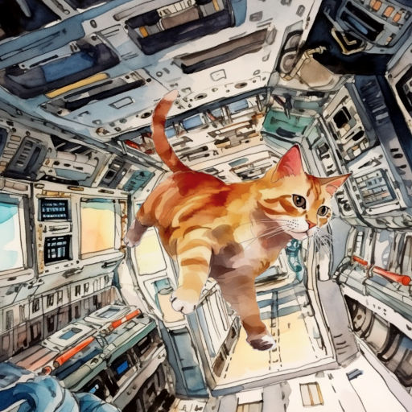
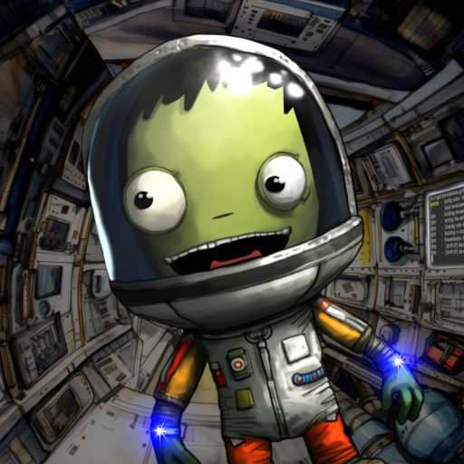
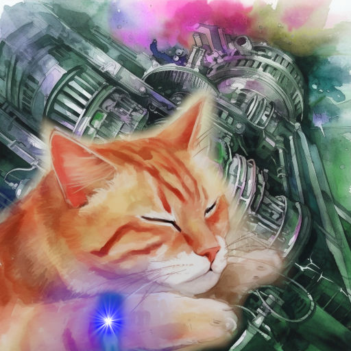
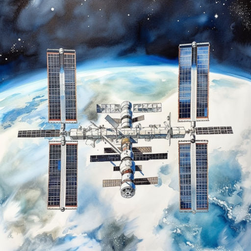

# Первый на орбите

За всю свою кошачью жизнь Тимошка не помнил такого шумного утра. Хозяин бегал, складывал и раскидывал вещи, разговаривал с кем-то по телефону. Пришли его друзья и тоже принялись суетиться. Рыжий кот сперва пытался разобраться, в чём дело. Но когда собственный хозяин наступил ему на хвост и даже не заметил этого, Тимофей обиделся и сел в уголок, исподлобья следя за неразберихой. Хотя он и пытался сделать вид, что его совершенно не интересует происходящее, уши у него сами собой вертелись, стараясь поймать хоть кусочек разговора.

-- Из-за чего же? -- спросил один голос.

-- Подменить космонавта, -- коротко ответил Егор Петрович, хозяин кота.

-- Как обычно? -- интересовался второй.

-- А Тимошка? -- осведомлялся третий.

-- Присмотрим, конечно! -- соглашались они хором.

-- Возьми галстук! -- советовал четвёртый.

-- Какой галстук? Космос!!! МКС!!! -- хватался за голову Егор Петрович.

Тимошка зажмурился от восхищения. Космос! Сколько всего он слышал об этом удивительном слове! Сколько рассказов хозяина, передач по телевизору, книг!

-- А может Тимошку с собой возьмёшь? -- донеслось из приоткрытой двери в комнату.

-- Первый кот в космосе будет[^1]! -- воодушевлённо восклицал кто-то.

[^1]: Единственная в истории кошка, отправившаяся в космос -- французская кошка Фелисетт. 18 октября 1963 года она достигла высоты около 100 километров и благополучно вернулась. Это был суборбитальный полет, то есть выхода на орбиту вокруг Земли не было.

Больше Тимошка сдерживаться не мог. Он подкрался к двери и с кошачьей ловкостью проскользнул в гостиную. Егор Петрович увлеченно разговаривал у окна с друзьями, не замечая своего любимца.

-- Какой кот?! -- вздыхал он.

-- Белка и Стрелка, собаки, летали! Почему бы и коту не слетать, а? -- с улыбкой предлагал второй.

"Почему бы не слетать?" -- мысленно вопросил Тимофей, уставившись на своего хозяина.

Ответа не последовало.

-- До вылета всего ничего! -- паниковал Егор Петрович. -- А вы тут со своими шуточками!

-- Успеешь, не волнуйся... -- успокаивал его четвёртый.

Кот шмыгнул в чемодан и зарылся в вещи. Сверху что-то докидывали, рылись, но Тимофея не заметили.

Сколько он так просидел, кот не знал. Сначала слышался разговор, потом чемодан захлопнули и сразу воцарилась темнота, а звуки стали приглушёнными. Тимошка всё прислушивался и принюхивался, а потом заснул, свернувшись калачиком среди вещей.

Проснулся он неожиданно от страшного шума и рокота. Спросонья он подумал, что попал в стиральную машинку[^2]. Тимошку буквально сдавило и сильно трясло.

[^2]: Коты очень любят наблюдать за работой стиральной машины. Известны несколько случаев, когда коты незаметно пробирались внутрь машинки, и их спасали хозяева после нескольких минут стирки. Возможно, с нашим героем в прошлом произошла такая же типичная история.

Так продолжалось несколько минут, но эти минуты показались коту вечностью. Когда же всё стихло, он облегчённо выдохнул. Перевернувшись поудобнее, Тимошка снова заснул.

А когда проснулся во второй раз, вокруг стояла абсолютная тишина. Он поворочался, поскрёбся и раскрыл чемодан. Вещи хозяина полетели в разные стороны, а сам кот поплыл по воздуху. Тимошка задёргался, пытаясь принять обычное положение, но только сильнее стал вращаться. Он перебирал лапами, крутился и наконец остановился, уцепившись за что-то. Изумлённо оглядываясь, кот понял: космос! Он на Международной космической станции! На МКС! Невесомость!

Поглядывая на вещи, парящие кругом, Тимошка поплыл искать выход, отталкиваясь от стен. Но вот он нащупал что-то, нажал и перед ним как в фантастическом фильме открылась дверь[^3] в светлый коридор. Кот поплыл дальше.

[^3]: На МКС нет автоматических раздвижных дверей, это художественный вымысел. Зато такие двери повсеместно встречаются в фантастических фильмах о космосе. Например, в "Звездных Войнах".

Вокруг пестрили разноцветные проводки и всевозможные блоки, всюду встречались поручни, от которых он отталкивался. Компьютеры и разная техника висели в самых неожиданных положениях. Тесный коридор петлял и изворачивался, отходили разные ответвления во все стороны, даже в потолок и пол, а Тимошка всё плыл[^4] по прямой. И вот впереди показалась своеобразная яма. Залетев внутрь, кот обомлел.

[^4]: Тимошка ловко справился с невесомостью, и легко перемещается по станции. На заре космической эры, кошки действительно участвовали в экспериментах с искусственной невесомостью на борту специального самолета. В отличие от нашего героя, участники экспериментов не так легко освоились. После тех экспериментов осталось [довольно забавное видео](https://youtu.be/J0AnmepzR4I).

Прямо под ним, на дне ямы, был большой иллюминатор. Ещё шесть поменьше вокруг него[^5]. И в этих иллюминаторах виднелась Земля! У кота аж дух захватило от этой красоты!

[^5]: Тимошка оказался в модуле Купол, предназначенном для наблюдения за поверхностью Земли и космическим пространством. Модуль имеет семь больших иллюминаторов для панорамного обзора. По рассказам космонавтов, в этом месте хочется проводить все свободное время на станции.

Планета показалась ему такой маленькой. Синяя-синяя, прикрытая белыми пёрышками облаков, она восхитила его и внутри у кота что-то встрепенулось. Вспомнился шарик, которым Тимошка играл со своим хозяином и ему сразу же захотелось домой, к шарику и Егору Петровичу. В памяти зазвучали слова песни, под которую хозяин крушил роботов в компьютерной игре. И он тихонько запел: "Земля в иллюминаторе, Земля в иллюминаторе[^6]..." Правда, со стороны его пение могло показаться просто протяжным завыванием и мяуканьем. Это мяуканье и привлекло членов экипажа МКС в обзорный купол.

[^6]: Тимошка напевает песню "Трава у дома" группы "Земляне". Песня входит в саундтрек популярной стрелялки "Atomic Heart", вышедшей незадолго до публикации рассказа "Первый на орбите" и принесшей новую популярность хиту восьмидесятых. Тимошка узнал об этой песне от игромана-хозяина, а я -- от папы.

-- Тимошка?!

Тимофей обернулся и снова нелепо закрутился.

-- Мяу-у? -- ахнул он, что значило "Егор Петрович?" Но его никто не понял, только стали разглядывать во все глаза, словно впервые видели кота. Тимошка приосанился, смотрят же!

-- Ты что здесь делаешь?! -- внезапно закричал Егор Петрович, размахивая маленькой гантелькой, с которой он никогда не расставался. -- Ты как вообще сюда попал?!

Кот собрался уже гордо поведать о своём шпионском пути, как побледневший космонавт, коллега Егора Петровича, проговорил:

-- К нам приближается НЛО... 

-- Какой НЛО? -- засмеялся усатый мужчина и тут же посерьёзнел. -- Космос — не место для шуток, товарищ... -- но тут он сам заметил в иллюминаторе странный космический объект, приближающийся к ним.

Ни одна из космических держав не владела такой техникой. Стального цвета корабль с таинственно мигающими зеленоватыми огоньками появился словно из ниоткуда.

-- С Земли предупреждения не было. Будем эвакуироваться! -- сурово заявил усатый, похоже, главный на станции. -- Есть несколько секунд!

Но было поздно. Раздался грохот, вся МКС затряслась и затем застыла. Неизвестный космический объект пристыковался к ней. Освещение выключилось, зажглись аварийные огни. Тимошка вздрогнул.

Все быстро покинули купол, кот едва успевал лететь за членами экипажа. Посуровевший Егор Петрович прихватил его под мышку и нагнал остальных. В сердце МКС собрался весь экипаж, космонавты переговаривались, решая, что делать.

Внезапно в коридоре что-то зашуршало, шорох становился все громче. Все, как загипнотизированные, смотрели на проём.

"Сейчас бы бластеры[^7]..." -- тоскливо подумал Тимофей. Но на МКС бластеров не было и в помине. Зато был некто, приближающийся к ним.

[^7]: Бластер -- популярное вымышленное оружие в фантастических произведениях. Похоже на пистолет, но стреляет не пулями, а светящимися "сгустками энергии". В похожей ситуации, про бластеры вспоминает Вовка, герой моего рассказа [Лето, в которое случилось это](summer.md).

И вот в дверном проёме появилось странное существо. Абсолютно неожиданно и абсолютно безмолвно оно возникло на пороге. Зажглись огоньки на манжетах незнакомца и в их тусклом свете члены экипажа Международной космической станции увидели зелёного пришельца.

Голова слишком большая, похожая на бидон. Короткие чёрные волосы приглажены, два раскосых выпученных глаза уставились прямо на экипаж. Одет в скафандр, на голове -- поблёскивающий шлем. Все, обомлев, воззрились на инопланетянина. И только Тимофей не растерялся.

-МАААУУУУ!!! -- грозно завопил на всю Вселенную кот и прыгнул прямо на незнакомца.

-- Прекратите. Это возмутительно[^8], -- вещал пришелец. -- По... -- но тут один его манжет соскочил, сам собой закрепился на лапе Тимошки и весь экипаж изумлённо уставился на кота, повисшего на пришельце и орущего человеческим голосом:

[^8]: Эту же фразу с забавным акцентом говорили инопланетяне-неймодианцы из торговой федерации в фильме "Скрытая угроза" (первый эпизод "Звездных Войн").

-- Ах так?! Сейчас подчинимся!!!

В коридоре виднелись плывущие силуэты спутников пришельца. Один из них принялся стаскивать кота с зелёного человечка[^9].

[^9]: Внешний пришельцев напоминает героев компьютерной игры "Kerbal Space Program" -- расу Кербалов, занимающихся мирным освоением и исследованием космоса. В игре надо строить и запускать космические корабли -- мне очень понравилось.

-- А ну, живо отпустили Тимошку! -- Егор Петрович первым пришёл в себя и замахнулся гантелей. Та выскользнула из его руки и полетела на пришельцев. А когда остановилась, легонько тюкнула инопланетянина, на котором повис кот. Пришелец посмотрел на них и вдруг заплакал, сжавшись в комочек.

-- Эм... Извините, -- неловко произнёс хозяин Тимошки, подлетая к коту и подхватывая своего любимца на руки.

-- Не думали вас обидеть, -- растерялся усатый командир МКС.

-- Мы хотели попробовать вашего борща. Наша еда, водоросли, подходят к концу, -- признался пришелец, глотая слёзы. -- И я предполагал, что "по-пожалуйста", это вежливость..., а вы дерётесь!

Тимошка неловко дёрнул хвостом.

-- Меня зовут Васенбренбур, я не знаю земных манер, -- произнёс другой. -- Мы пришли с миром и просим вас о помощи.

-- Васбренбам... Ну, Вася, по нашему, -- начал командир -- А что у вас произошло?

Вася снял свой шлем, поняв, что в открытый космос его выбрасывать не собираются[^10]. Остальные пришельцы последовали его примеру.

[^10]: Пришелец Вася заблаговременно надел шлем, боясь что его выбросят в открытый космос. Ведь именно так земляне расправлялись с агрессивными инопланетянами в серии фильмов о "Чужих".

-- Наш корабль отправился в экспедицию по исследованию далёких планет, -- стал рассказывать Вася, держа шлем в руках. -- Последней мы исследовали самую крохотную планету вашей системы, ближайшую к большому огненному шару. Оказалось, что расстояние от нашей родины до финального объекта изучения превысило расчётное и припасы на обратный путь подошли к концу. Наш корабль посылал радиосигналы с просьбами о помощи. Мы долго ждали ответа, но его не было. Уже отчаявшись, продолжали слушать радиоволны, надеясь уловить хоть какой-то сигнал. Но вместо него мы случайно подслушали разговор. В нём упоминалась планета Земля, орбита, космос, МКС... Но самым главным для нас был борщ! Проанализировали все данные про Землю, поняли, что нашему кораблю не хватит топлива на посадку и взлет с планеты. Поэтому единственным шансом пополнить припасы стала стыковка с вашей станцией. Мы вычислили ваши координаты и немедля направились к вам.

-- А как же ваш стыковочный узел подошёл к нашему? -- удивился глава МКС.

-- Он сделан по особым технологиям, из жидкого металла! -- пояснил Вася. -- Сам принимает нужную форму!

-- А у нас такое только в фантастических фильмах[^11]... -- проговорил Егор Петрович.

[^11]: Пришельцы владеют технологией "жидкого металла" -- такой же, как показана в фильме "Терминатор 2". Однако, в отличие от фильмов, пришельцы используют жидкий металл не для производства злых неуязвимых роботов, а в мирных целях -- для создания универсального стыковочного узла на своем космическом аппарате. Егор Петрович явно смотрел "Терминатор 2", судя по его реакции.

Связи с Землёй не было. Командир МКС, посовещавшись с экипажем, отдал распоряжение принести к стыковочному узлу тюбики с космическим борщом.

Пришельцы обрадовались, поплыли к своему кораблю и смотрели на розовые[^12] тюбики как на восьмое чудо света.

[^12]: Космическая еда российского производства действительно имеет розовую маркировку на упаковке. Эту и другие интересные подробности об МКС и быте космонавтов я узнала из познавательного видео [ЭКСКУРСИЯ ПО МКС от астронавта NASA](https://www.youtube.com/watch?v=i_Yp64ZaAJs).

-- Нашли чем восхищаться! Борщ! -- фыркнул Тимошка, вырвавшись из рук хозяина.

Тут все вспомнили, что кот приобрёл дар речи.

-- Любопытно. Не знал, что манжеты-переводчики работают и у животных, -- заметил Вася. -- Нам для хорошего и надёжного перевода необходимо два манжета. Хотя один тоже справляется, он может барахлить без пары.

-- Любопытно -- мягко сказано! -- Егор Петрович почесал затылок.

-- Шеф! -- вдруг один из инопланетян подплыл к Васе. -- Протонный изурчатель сломан! Двигатель не заводится!

-- Что ж-ж-же д-д-делать-то?! -- снова заплакал первый пришелец, на которого напрыгивал Тимошка. -- К-к-как мы в-в-вернёмся?! -- похоже, его манжет действительно начал барахлить.

-- А как он работает, этот изурчатель? -- спросил Егор Петрович.

-- Он как бы... -- принялся объяснять Вася. -- Излучает урчание. Звуковыми колебаниями задаёт тактовую частоту, без нее двигатель не заведётся...

-- Товарищи! -- вдруг появился один из космонавтов. -- Мы снижаемся! Из-за толчка при стыковке мы сошли с орбиты, через тридцать минут войдем в атмосферу!

-- Нашего топлива не хватит, чтобы выправить траекторию! -- добавил другой.

-- А наш двигатель вообще заглох, вместе упадем... -- печально пробормотал Вася.

-- Я могу попробовать запустить двигатель! -- заявил Тимошка.

-- А как? -- удивились все.

-- У тебя же лапки! -- добавил Егор Петрович.

-- Ну, я очень хорошо умею урчать! -- важно сообщил Тимошка. -- Поурчу, задам эту самую частоту. Вы, Вася, выправите нашу траекторию вашим двигателем! Только почешите меня за ушком, а то ничего не получится.

-- Конечно, конечно! -- Вася снова воспрянул духом. -- Скорее!

Кота проводили в пристыкованный к МКС корабль пришельцев. Внутри царил полумрак, но тут же зажглись зеленоватые лампы и темнота рассеялась. Открыли люк в стене, и взгляду Тимошки предстало непонятное устройство.

-- Вот он, двигатель, -- произнёс Вася.

-- Хорошо, чешите! -- Тимошка подставил головку пришельцу.

Вася осторожно почесал кота. Тимошка сначала тихо, а потом громче заурчал. Внутри устройства что-то запыхтело, заурчало в такт Тимошке. Двигатель завёлся.

-- Ура! -- в один голос воскликнули пришельцы.

-- Как же твоё урчание подошло к нашему двигателю? -- радостно спросил Вася.

-- А я как ваш стыковочный узел из жидкого метала! -- гордо ответил Тимофей. -- Придал своему урчанию нужную форму[^13]! Теперь не глушите двигатель до самого дома.

[^13]: Тимошка запускает двигатель корабля, "придав своему урчанию нужную форму", и сравнивает эту свою способность со свойствами "жидкого металла". Это отсылка к популярному мему [коты -- это жидкость](https://dzen.ru/a/Ylmo6yGuVhBLwgMG).

Кот вернулся на МКС и вместе с членами экипажа сквозь иллюминаторы в куполе смотрел на корабль пришельцев. На нём зажглись огоньки, звездолёт чуть затрясся. МКС тоже задрожала, все почувствовали плавное ускорение и ухватились за поручни. Наконец, тряска закончилась и вернулась невесомость. Курс был поправлен, опасность миновала.

В купол вплыл Вася.

-- Спасибо! -- горячо воскликнул пришелец. -- Я впервые увидел кота, весь ваш вид такой сообразительный?

Тимофей приосанился, за гордостью скрывая печаль расставания.

-- Вам спасибо! -- вместо кота ответили все члены экипажа.

-- Манжет оставлю вам, -- продолжил Вася. -- Наш подарок, -- и он широко улыбнулся. -- Прощайте, собратья по разуму!

Вася уплыл к стыковочному узлу. Через некоторое время звездолёт медленно начал отделяться от МКС. Тимошка вместе с членами экипажа смотрели на него сквозь иллюминаторы. Внезапно из трёх сопел вырвался зеленоватый огонь и корабль исчез среди звёзд.

***

В назначенный день посадочная капсула с Егором Петровичем, Тимошкой и ещё двумя космонавтами приземлилась где-то в степи. Космонавты и кот выбрались наружу с помощью подоспевших наземных служб.

Сухая трава, редкие деревца, бледное, словно выжженное солнцем небо. И очень жарко. Началась суматоха перевозки и Тимошка обронил манжет.

А потом Тимофея наградили орденом за смекалку. Первый на орбите кот просто таял от похвал и комплиментов, но с грустью думал:

"Жалко, что манжет потерялся. Я бы такую замурчательную[^14] речь сказал..."

[^14]: Забавное словечко "замурчательный" часто используется в качестве шутливого аналога слова "замечательный" с кошачьим подтекстом. Мне доподлинно неизвестно, откуда оно появилось. Возможно, из рекламы кошачьего корма.

Даже когда он ворочался дома на своей лежанке, эта мысль продолжала не давать ему покоя.

А в это же время, в степи уже наступило утро. Молодой волк стремительно нёсся за зайцем. Внезапно раздался щелчок, кольцо охватило волчью лапу. И на всю степь разнёсся возглас:

-- Ну, заяц! Ну, погоди![^15]

[^15]: Волк произносит фразу своего собрата из мультсериала "Ну, погоди", повторяющуюся в каждой серии. 

*08.04.2023 г., автору 11 лет.*

