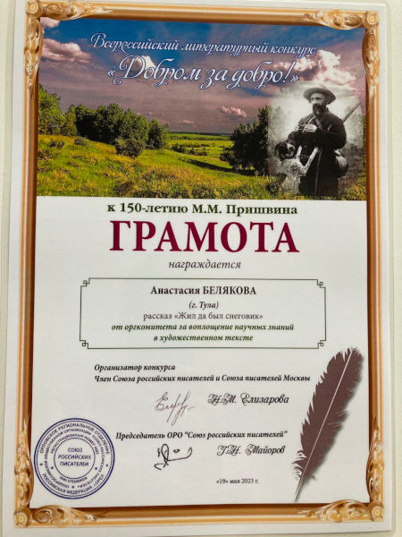

# Жил да был Снеговик...

Была зима. Посреди одного двора стоял Снеговик. Стоял день, другой, третий. На четвёртый день Снеговик заскучал. Каждые сутки одно и то же!

Каждое утро по двору бегают ребята. Каждый полдень из подъезда выходит старушка и кормит красногрудых звенящих снегирей. И каждый вечер из-за угла пятиэтажного дома выбегает взлохмаченный весёлый сенбернар, волоча следом паренька с веснушками. 

Снеговик мечтал стать путешественником. Он хотел увидеть, что делается за пределами двора. Хотел походить, побегать. Но он не умел, а научить его было некому.

Спустя три месяца началась весна. Снег искрящимися, певчими потоками тёк по земле, сосульки на крыше заплакали хрустальными слезами. Нежный, юный ветерок вынырнул откуда-то из-за кустов и легко коснулся Снеговика. Солнце ласкало его тёплыми лучами, вода журчала чистую песню весны... Пригревшись, Снеговик погрузился в сладкую дрёму...

Очнулся он среди первых подснежников. Их белые головки тихо покачивались в такт южному дыханию ветра. Оглядевшись вокруг, ему стало ясно: он уже не Снеговик. Под весенними лучами бывший Снеговик растаял и превратился в Ручей.

Его мечта сбылась: он может путешествовать! И он больше не одинок! Теперь не ледяная пурга будет петь ему колыбельную, а крохотные птахи. И не сугробы будут молча взирать на него, а изумрудная трава и стройные деревья станут приветливо махать веточками и стебельками...

Долго странствовал он по свету. Ручей любовался лесами, горами, сёлами и деревушками. Много нового узнал он о жизни.

В одно утро Ручей остановился у моря.
Его поразила скользящая необъятность водных просторов, влажное солёное дыхание моря, бреющий полёт гордых чаек. Пена прибоя бело-жёлтым слоем лежала на тёмном песке, лазурная вода чуть подёрнута золотистой рябью бликов...

Ручей втёк в море.

Стал он частью моря. Он восхищался рыбами, скатами, огромными пароходами и крохотными лодочками. Таинственный, неясный для нас, открылся ему подводный мир во всей красоте рифов, лагун, мелей и тёмных глубин.

Однажды бывший Ручей всплыл на морскую поверхность. Было лето, стояла сильная жара.
Тут он почувствовал, что поднимается в небо. А пока летел, превратился в Облако.

И поплыло белое Облако над землёй. Глядело с высоты на изумрудные деревья, огромные города, зубчатые скалы, вонзающиеся вершинами в голубые небеса, горные озёра, сияющие хрустальным блеском...

Часто мимо него проносились самолёты, к окнам которых липли ребята. Тогда, чтобы их повеселить, Облако принимало разные образы. То превратится в гордого жирафа, то станет свободной птицей. Прихотливо и тщательно, как модница платья, выбирало оно причудливые силуэты.

Несколько месяцев парило Облако над миром. И в декабре остановилось над двором, где когда-то стоял Снеговик-мечтатель.

И вдруг Облако рассыпалось тысячей снежинок!
Полетели они, кружась в серебристом хороводе Зимы, на землю. Весь двор к утру был устлан мягким снежным ковром.

А к обеду дети скатали снеговика. И стал он стоять посреди того же двора. Те же мальчишки, та же старушка, тот же весёлый сенбернар.

Но это днём. А ночами Снеговику снились густые прохладные леса, морской парад причудливых рыб и стремительные самолёты. 

*2021 г., автору 9 лет.*

***

Это произведение участвовало в конкурсе к 150-тилетию со дня рождения М. М. Пришвина "Добром за добро!" и награждено грамотой.

