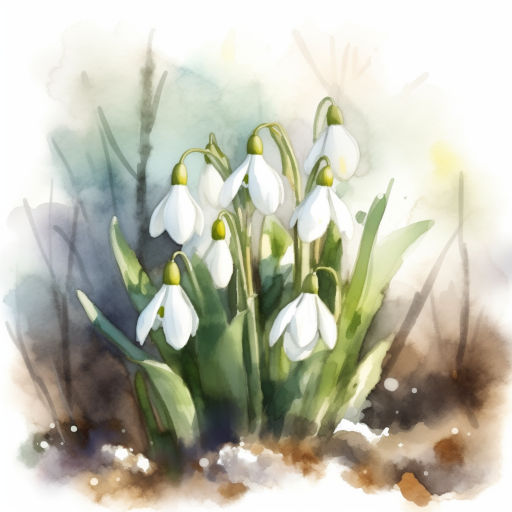
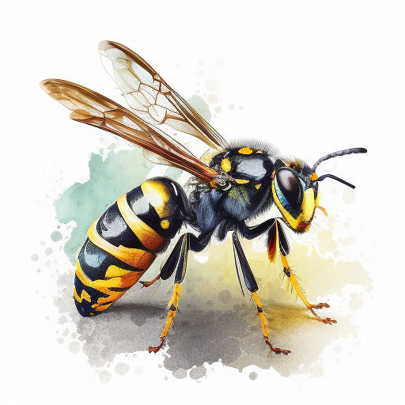
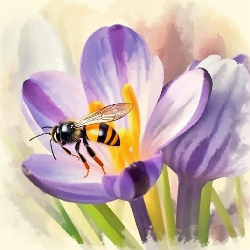

# Соня полосатая

> Этот рассказ основан на реальных событиях, произошедших в моём классе. Соня полосатая -- реальный персонаж, а все остальные -- вымышленные.

Весенние каникулы выдались тёплыми и солнечными. Я гуляла по парку, любовалась подснежниками, слушала пение птиц. Но вот наступил первый учебный день, и резко захолодало. Небо стало серым, подул холодный ветер. Того и гляди снег пойдёт.

Я направлялась к школе, пиная мелкие камушки. Настроение с утра хмурое, под стать погоде. Крокусы в палисаднике соседнего дома почуяли холод и не раскрыли свои бутоны.

Пройдя полпути, я вдруг поняла: переобувка осталась дома. В руках-то ничего нет! Я развернулась и побежала обратно домой.

"Эх, как хорошо было на каникулах!" -- подумала я.

Выбегая из-за угла дома, я напугала соседского кота Барсика, мирно гулявшего во дворе. Но мне было некогда обращать на него внимание. Вбежав в подъезд, я поднималась на свой четвёртый этаж, перешагивая за раз через две ступеньки. Войдя в прихожую, я застала своего кота Мурзика на месте преступления. Проснувшийся кот увлечённо грыз завязки моего мешка со сменкой. Я освободила переобувку из лап Мурзика, заперла дверь в квартиру и побежала обратно в школу.

Прибежала я уже после звонка. Пустые коридоры и лестницы, звенящая тишина. Пока поднималась на второй этаж, я вспомнила, как несколько месяцев назад опоздала на новогодний праздник. Войдя в класс и извинившись за опоздание, я заметила, что моё обычное место у стены занято. Учительница Мария Ивановна попросила сесть за пустую парту у окна. Я быстро расположилась на новом месте, и урок математики продолжился.

Я вообще не очень люблю математику, поэтому слушала вполуха, чаще смотря в окно, чем на доску. Погода стояла пасмурная. Было так хмуро, словно уже вечерело. Деревья грустно покачивали голыми ветвями, изредка пролетали птицы, проезжали машины. А урок всё продолжался и продолжался. Часы над доской встали, и было неизвестно, сколько ещё ждать перемену.

Наконец, раздался долгожданный звонок, и вся школа ожила. Учительница открыла окно в кабинете на проветривание, и наш четвертый "В" поспешил в столовую на завтрак.

Увидев в столовой ненавистную морковную запеканку, я отпросилась у учительницы в буфет. С трудом протиснувшись через толпу, мне удалось купить последнюю сахарную булочку -- мою любимую.

По дороге я не успела съесть булочку, а когда вошла в кабинет, наши заводилы Ромка и Мишка стали просить:

-- Люся, дай отщипнуть кусочек!

От булочки оставалась небольшая часть, когда трещащий звонок разогнал всех по местам. Начался второй урок -- русский язык.

Было очень и очень скучно. Некоторые даже начинали клевать носом. Я сама прилегла головой на парту и смотрела на мир за окном. Внезапно я заметила что-то на подоконнике.

Я подняла голову и чуть не ахнула. На подоконнике сидела сонная оса!

Вдруг я услышала голос Марии Ивановны:

-- Молодцова, что это ты в окне увидела? -- учительница подошла ко мне и остановилась рядом с моей партой.

-- На подоконнике оса, -- негромко ответила я.

-- Оса? -- ахнул кто-то.

Скуки как не бывало. Все сразу оживились, ряд у стены принялся вытягивать шеи, кабинет наполнился шумом. 

-- Откуда здесь оса? -- удивилась Таня, сидящая впереди меня.

Учительница вернулась к своему столу и пояснила:

-- Вчера было тепло, а сегодня похолодало. Осе стало холодно, и во время перемены она залетела к нам в открытое окно. Не шевелится, наверное заснула.

-- Она прилетела к нам поспать! -- объявил Мишка.

-- Вот это *соня полосатая*! -- подхватил Ромка. -- Храпит на подоконнике!

Все засмеялись и принялись храпеть на разные лады: "Хррр-фрр, фррр-хрр..." Оса зашевелилась и поползла в мою сторону -- похоже, мы её разбудили. Мария Ивановна отвлеклась, стала утихомиривать класс. А я украдкой достала из рюкзака остатки булочки. Собрав немного сахара, я насыпала его перед осой. Та походила вокруг и призадумавшись, остановилась. Наконец, она приняла угощение.

-- Приятного аппетита! -- прошептала я.

Потом гостья поползла дальше, оставив мою пятую парту позади. Добравшись до Таниного места, оса принялась ходить рядом с ним.

-- Ой! -- воскликнула Таня.

-- Что случилось? -- Мария Ивановна снова прервала свою речь о глаголах и взглянула на Таню.

-- Мария Ивановна, -- проговорила девочка. -- Я осы боюсь!

Танина соседка поддержала её, и они принялись просить выпустить осу. Учительница взяла тряпочку для протирки доски и подошла к нам. Приоткрыв окно, Мария Ивановна осторожно смахнула осу.

-- Ну вот, всё в порядке, -- сказала учительница. -- Оса улетела. Продолжим урок.

Иногда Мишка с Ромкой всхрапывали с последней парты среднего ряда: "Хррр-фрр..." продолжая изображать полосатую соню. Когда шутка надоела, они принялись перешёптываться:

-- Как же там оса?

-- Улетела.

-- А вдруг она упала спросонья?

-- Давайте после уроков найдём её! -- обернувшись, шёпотом предложила я.

Мне так хотелось поскорее найти осу, что весь учебный день я была рассеянной, никак не могла дождаться конца занятий. Даже любимый урок музыки сегодня меня не интересовал -- я не пела, а только открывала рот для вида. Но вот последний звонок взбодрил школу, и все высыпали на улицу.

Мы с Мишкой и Ромкой долго ходили под окнами нашего кабинета, искали на тротуаре осу. Но её не было. Ребята уже собрались расходиться по домам, когда я подошла к клумбе и позвала их:

-- Смотрите!

Одноклассники поспешили ко мне.

-- Оса! -- радостно воскликнули мы.

И действительно, на цветке крокуса сидела наша оса. Потеплело, и она уже не выглядела сонной. Деловито зажужжав, оса взлетела ввысь и скрылась из виду. Впервые за день выглянуло яркое весеннее солнце.

*04.04.2023 г.*

!!!info "Также читайте"
    Ещё один рассказ про Люсю -- [Подготовка к празднику](preparation-for-festival.md).
